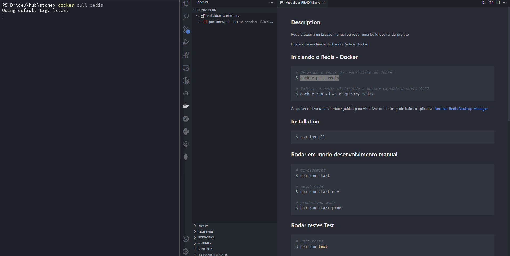
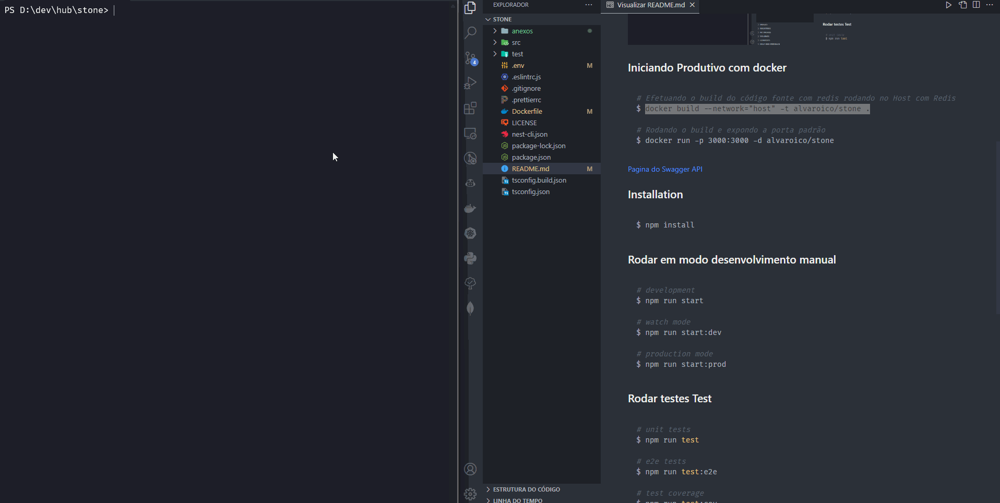
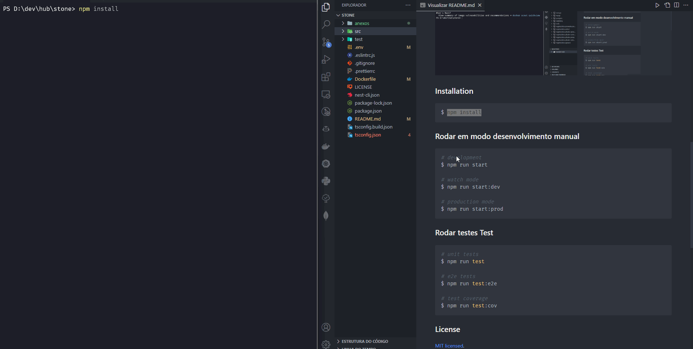
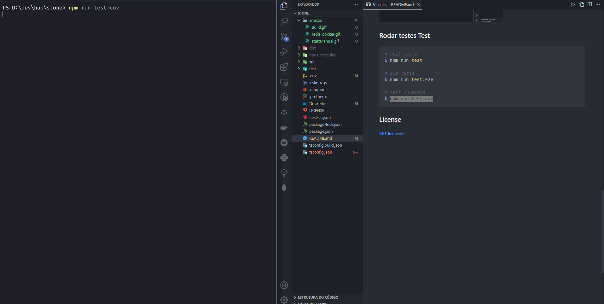
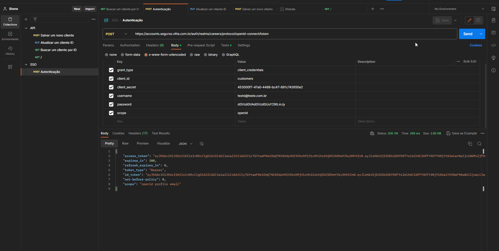

## Description

Pode efetuar a instalação manual ou rodar uma build docker do projeto

Existe a dependência do bando Redis e Docker

## Iniciando o Redis - Docker

```bash
# Baixando o redis do repositório do docker
$ docker pull redis

# Iniciar o redis utilizando o docker expondo a porta 6379
$ docker run -d -p 6379:6379 redis
```

Se quiser utilizar uma interface gráfica para visualizar do dados pode baixa o aplicativo <a href="https://github.com/qishibo/AnotherRedisDesktopManager">Another Redis Desktop Manager<a>



## Iniciando Produtivo com docker

```bash
# Efetuando o build do código fonte com redis rodando no Host com Redis
$ docker build --network="host" -t alvaroico/stone .

# Rodando o build e expondo a porta padrão
$ docker run -p 3000:3000 -d alvaroico/stone
```

<a href="http://localhost:3000/api">Pagina do Swagger API<a>



## Installation

```bash
$ npm install
```

## Rodar em modo desenvolvimento manual

```bash
# development
$ npm run start

# watch mode
$ npm run start:dev

# production mode
$ npm run start:prod
```



## Rodar testes Test

```bash
# unit tests
$ npm run test

# e2e tests
$ npm run test:e2e

# test coverage
$ npm run test:cov
```



## Rodar testes Test de bancada



## License

[MIT licensed](LICENSE).
